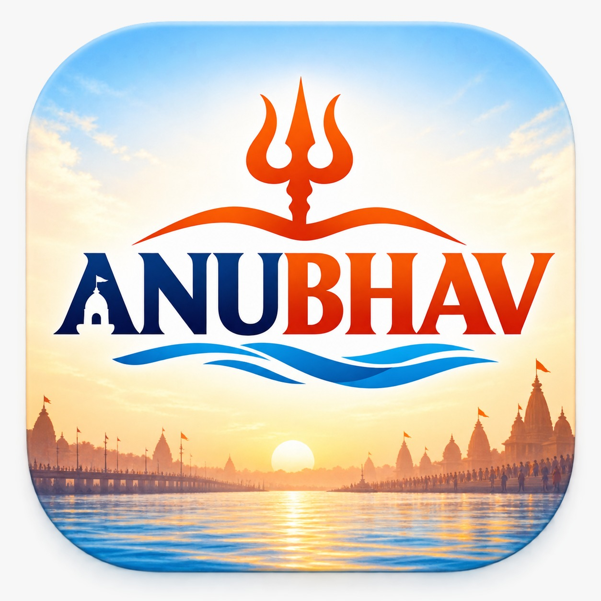
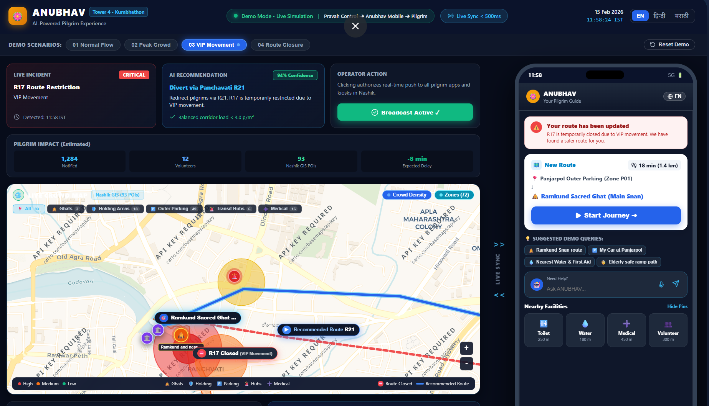

<div align="center">
  
  <h1>ANUBHAV (अनुभव)</h1>
  <h3>Intelligent Pilgrim Experience & Mobility Planning Platform</h3>
  <p><i>"Har Yatra Ek Anubhav — Your AI Companion for a Safe, Seamless & Spiritual Kumbh Mela Experience"</i></p>

  <p>
    <a href="https://flutter.dev"></a>
    <a href="https://fastapi.tiangolo.com"></a>
    <a href="https://supabase.com"></a>
    <a href="https://ai.google.dev"></a>
    <a href="http://project-osrm.org"></a>
  </p>

  <p>
    <b>Event:</b> Kumbhathon SPRINT 2026 &nbsp;|&nbsp; 
    <b>Tower:</b> 4 — Pilgrim Experience &nbsp;|&nbsp; 
    <b>Team:</b> Sanket
  </p>
</div>

---

## 👥 Team Members
- [@Gursevaksingh84](https://github.com/Gursevaksingh84)
- [@SakshiZurale](https://github.com/Sakshi-Zurale)
- [@kalpesh-28](https://github.com/kalpesh-28)
- [@warungasenikhil49-byte](https://github.com/warungasenikhil49-byte)
- [@Jaware-Shruti-15](https://github.com/Jaware-Shruti-15)

---

## 🌟 Executive Overview & Solution Architecture

<div align="center">
  
</div>

> *ANUBHAV ensures every pilgrim knows what to do."*

### 📌 Core Tenets from the Executive Overview:
- 🚨 **The Problem & The Critical Gap**: Over 10 million daily pilgrims face intense crowd confusion at ghats, sudden road closures due to VIP movements, parking uncertainty, and language barriers. Operational intelligence exists in the Command Center (PRAVAH), but fails to reach pilgrims in a personalized, actionable form.
- 💡 **Our Solution — ANUBHAV**: An AI-powered, multilingual pilgrim companion converting live command-center telemetry into proactive, personalized step-by-step guidance.
- ⚙️ **How It Works**: Crowd sensors + police alerts + parking status + weather + road closures $\rightarrow$ **ANUBHAV AI Decision Engine** $\rightarrow$ instant answers to *"What should I do next?"* (Safe routes, best snan time, nearby facilities, spiritual recommendations).
- 📈 **System Impact**: 
  - **For Pilgrims**: Safer journeys, reduced waiting times, lower stress, accessible native languages, and an elevated spiritual experience.
  - **For Authorities**: Better crowd distribution, faster emergency response, reduced bottleneck congestion, and efficient resource allocation.
- 🌐 **Scalable Beyond Kumbh**: A reusable smart-event mobility architecture designed for India's largest mega-gatherings (Maha Kumbh, Pandharpur Wari, Tirupati, Vaishno Devi, Jagannath Rath Yatra, Ganesh Visarjan, Amarnath Yatra, and Smart Cities).

---

## 🎥 2-3 Minute AI Pitch Video & Live Showcase
🎬 **Watch the Official ANUBHAV AI Pitch Video:** [**Watch `pitch_video.mp4`**](./pitch_video.mp4) | [**Open Walkthrough Guide in DEMO.md**](DEMO.md)

---

## 🧪 Simulated Multi-Service Prototype (`/Prototype`)

Alongside the main Flutter production application and FastAPI backend, this repository includes the **Simulated Multi-Service Prototype** (`/Prototype`). It provides a lightweight, self-contained simulation of the entire Kumbh digital ecosystem running in real-time across four distinct personas:

```
apps/pilgrim-app   → Deployed independently (PWA for pilgrims, calling API & MapLibre)
apps/admin         → Deployed independently (PRAVAH police dispatch console with login gate)
apps/kiosk         → Deployed independently (Fullscreen touch & voice terminal for stations & ghats)
services/api       → Deployed independently (Node/Express API with auth & 7 agent tools)
packages/shared    → Shared design tokens, TierBadge, Supabase Realtime helper, i18n dictionaries
database/          → Supabase Postgres schema.sql & seed.sql with real Nashik coordinates
```

### 🎯 Key Prototype Capabilities:

<div align="center">
  
</div>

1. **Interactive Multi-Panel Simulation Canvas (`Prototype/src/components/UnifiedShowcase.tsx`)**:
   - Allows judges and evaluators to observe the **Pilgrim App**, **PRAVAH Admin Console**, and **Station Kiosk** concurrently in one unified view.
2. **Real-World Nashik GIS Integration**:
   - Packaged with `nashik-all.geojson` (7.2 MB of real road geometries, ghat boundaries, and pilgrim amenities).
3. **Instant Detour & Siren Smoke Test**:
   - Triggering a **Force Close R17 (VIP Procession Emergency Override)** in the Admin Console immediately causes both the Pilgrim App and the Station Kiosk to sound an alert siren and reroute in real time via Supabase Realtime without a browser refresh.

### 🚀 How to Run the Prototype:

```bash
cd Prototype
npm install
npm run dev
```
*Opens the unified simulation canvas at `http://localhost:5173`.*

To run all individual services concurrently:
```bash
npm run dev:multi
```
- **API Backend**: `http://localhost:4000`
- **Pilgrim App**: `http://localhost:5173`
- **Admin Console**: `http://localhost:5174` (Login: `admin` / `pravah2026`)
- **Station Kiosk**: `http://localhost:5175`

---

## 📌 Executive Summary

During the **Nashik Trimbakeshwar Kumbh Mela 2026**, over 10 million pilgrims arrive daily facing heavy congestion, complex parking regulations, walking restrictions, and shifting crowd densities. 

**ANUBHAV** (*अनुभव*) is a production-grade, multimodal AI mobility assistant that transforms free-form voice and text requests in **Hindi, Marathi, and English** into executable, turn-by-turn pilgrimage itineraries. Grounded in **3,266 real geo-located Kumbh data points** across Nashik and Panchavati, ANUBHAV combines:
1. **Dual-Provider Agent Intelligence** (Google Gemini 3.6 Flash with automated Groq / xAI fallback)
2. **Real-World Pedestrian & Highway Routing** via OSRM (real footpath polylines, not straight-line stubs)
3. **Official Kumbh Traffic Zoning Rules** (routing highway private cars to outer staging lots + government electric feeder shuttles)
4. **Native Cross-Platform Mobile & Web Client** built with Flutter, featuring live GPS tracking, step simulation, proactive proximity heritage alerts, in-journey detours, and return-to-parking routing.

---

## 🚀 Key Innovations & Capabilities

### 1. Multilingual Voice-First Planning (Hindi, Marathi, English)
- Pilgrims can speak naturally:
  - *Hindi*: "धुले से कार से आ रहे हैं, रामकुंड में पवित्र स्नान करना है, पूरी यात्रा की योजना बनाएं।"
  - *Marathi*: "आई-वडिलांसोबत नाशिकमधील प्रमुख मंदिरांचे दर्शन घ्यायचे आहे, एक नियोजन तयार करा."
  - *English*: "Coming from Mumbai by car, want to perform holy snan at Ramkund with my elderly parents."
- The agent accurately speaks back in the user's native language with synchronized visual chat bubbles.

### 2. Outer-Zone Parking & Feeder Shuttle Transit Integration
- Per Kumbh Mela traffic guidelines, private vehicles arriving from highways (Dhule, Mumbai, Pune) are directed to **outer parking staging zones** (e.g. Panjarpol Outer Lot, Valdevi Staging).
- Generates a 4-leg tactical sequence:
  1. `parking`: Park private vehicle at designated outer lot (₹20).
  2. `transit_segment`: Government electric feeder shuttle to inner Panchavati Drop Point (₹15, departs every 5 mins).
  3. `walk_segment`: Real footpath routing from drop point to sacred destination.
  4. `visit`: Sacred darshan/snan queue with live wait telemetry.

### 3. Crowd-Aware Sequencing for Families & Elders
- If Ramkund ghat congestion is high, ANUBHAV automatically prioritizes less-crowded, step-free prominent temples first (**Kalaram Sansthan Temple** with wheelchair ramp $\rightarrow$ **Kapaleshwar Temple** $\rightarrow$ **Ramkund Ghat**), explaining the reasoning aloud.

### 4. Interactive Live Map with Real Walk Simulation & Proximity Audio
- Native Flutter map overlay with turn-by-turn route polylines.
- Built-in **Walk Simulator (1x, 5x, 20x)** allowing pilgrims and judges to experience walking through the sacred corridor.
- **Proximity Audio Alerts**: As pilgrims walk past prominent heritage shrines, ANUBHAV proactively speaks alerts aloud (*"Kalaram Temple is on your left, 60 meters away. Tap to visit."*).

### 5. In-Journey Detours & Quick Facility Search
- Pilgrims can search for **Toilets, Annakshetra Food, Medical, or Temples** mid-journey.
- Tapping **"Detour Here"** triggers surgical, sub-second OSRM rerouting through the amenity and onward to the final destination without LLM latency.
- Home page includes one-tap **"Go" Direct Navigation** to immediate facilities.

### 6. "Way Back to Your Parking" Return Navigation
- Upon reaching the sacred dip at Ramkund, ANUBHAV announces darshan completion and activates a prominent **"Way Back to Parking"** flow.
- Generates the return journey (Ramkund $\rightarrow$ Panchavati Drop Point $\rightarrow$ return feeder shuttle to outer parking $\rightarrow$ parked vehicle).

### 7. Colour-Coded Crowd Navigation
- Every `walk_segment` and POI marker carries a dynamic `crowd_color` (`green` = low, `yellow` = medium, `red` = high) computed in real-time from `get_crowd_levels`.
- The Live Map renders each walking stretch as an independent, segmented polyline in its specific crowd color rather than a single uniform route color.
- Ghat and POI pins are tinted with matching crowd halo borders and glowing indicator dots.
- Background polling refreshes segment and marker crowd colors every 30 seconds as crowd density changes.

### 8. One-Tap Utility Search (Zero Typing)
- 4 prominent one-tap utility buttons on the Home screen for urgent pilgrim needs:
  - 🚻 **Toilet** (Sanitized municipal facilities)
  - 🏥 **Medical** (Emergency first aid & triage)
  - 🍲 **Food** (Satvik Annakshetra meals)
  - 💧 **Water** (Continuous 4-stage RO chilled Jal Seva)
- Tapping any button immediately pipes `get_nearby` through `rank_by_experience` without typing a single word into the search box.
- Opens the Stage 8 structured detail sheet for the **#1 Top Pick** (with live sensor status, wait time, crowd trend, why recommended, and amenities), while displaying other ranked candidates (#2, #3, etc.) below with rank badges and one-tap "Select" / "Add to my route".

### 9. Dedicated Travel Planner with Group-Aware Planning
- Dedicated **"Plan"** tab in the app navigation shell (`Ask ANUBHAV`, `Plan`, `Live Map`, `Explore`).
- **Today's Overview**: Real-time Ghat Congestion Forecast with color-coded hourly bar chart across the day (green/orange/red) for Ramkund vs Talkuteshwar Ghat, plus an **Optimal Darshan Window** callout (*"07:15–08:30 AM, target wait <15 min"*).
- **"Plan for Today" Intake Form**: Captures party size, elderly members count (60+), children count (under 12), arrival time, and transport mode.
- **Rule 1a Vulnerable Group Substitution**: If elderly or children are present, the agent automatically recommends **Talkuteshwar Ghat** over Ramkund, displaying visible reasoning:
  > *"Ramkund currently experiencing heavy congestion (45+ min queue, high density). Recommended Talkuteshwar Ghat — 12 min away, lower crowd, dedicated senior assistance, safe for families."*
- **Two Clear Action Paths**:
  - **"Start Journey"**: Accepts the recommendation, generates the route to Talkuteshwar, and switches directly to Live Map.
  - **"Plan for Ramkund instead"**: Honors explicit user override, generates a route to Ramkund with an active crowd safety advisory, and flags the nearest medical post.

### 10. Complete Teammate UI Merge & Single Navigation System

<div align="center">
  
</div>

- **Unified Visual Layer & Stitch Design System**:
  - Production-grade screens and widgets styled with consistent typography using Google Fonts (**Epilogue** display/headlines, **Plus Jakarta Sans** body/labels).
  - Cohesive Kumbh color palette: Saffron Primary (`#A33900`), Sacred Blue (`#1D4ED8`), Marigold Gold (`#855300`), and semantic crowd density colors.
- **GoRouter Navigation with 5 First-Class Branches**:
  - `/home`: Live crowd heatmap, search bar, one-tap shortcut icons, and live aggregate telemetry cards.
  - `/plan`: Travel Planner, Rule 1a group-aware vulnerable substitution, and hourly crowd forecast.
  - `/route`: Segmented crowd-colored polylines, crowd-tinted POI markers, simulation toolbar, proximity alerts, and return-to-parking CTA.
  - `/help`: Emergency SOS dispatch, Lost & Found reports, Medical Camps, Volunteer Desks, Admin Directory, and Safety Guidelines.
  - `/more`: Multilingual language selector, app preferences, and guide.
- **Desktop & Web Mode Support**:
  - Toggle between responsive wide desktop mode and phone frame mockup mode for presentations.

---

## 🏛️ System Architecture

```
                          ┌────────────────────────────────────────┐
                          │     Flutter App (Android / Web / Win)  │
                          │   Home / Live Map / Explore / Audio    │
                          └───────┬────────────────────────┬───────┘
                                  │                        │
                         HTTP     │                        │ Supabase Realtime
               (/plan, /patch)    │                        │ (Live Corridor Alerts
                                  │                        │  & Trip Patches)
                                  ▼                        ▼
                      ┌──────────────────────┐     ┌──────────────────────┐
                      │   FastAPI Backend    │     │   Supabase Postgres  │
                      │  (tool_executor.py,  │────▶│ (3,266 Kumbh POIs,   │
                      │   agent.py, OSRM)    │◀────│  Trips, Trip Patches)│
                      └──────────┬───────────┘     └──────────────────────┘
                                 │
                        Dual LLM Provider
                                 │
              ┌──────────────────┴──────────────────┐
              ▼                                     ▼
       Google Gemini 3.6 Flash               Groq / xAI Fallback
       (Native Tool-Use Loop)                (On 429 / Quota Limits)
```

### 8 Canonical Domain Tools Grounded in Real Kumbh Data:
1. `get_parking_options(vehicle_type, dest_lat, dest_lng)` — Filters outer vs. inner lots by origin and highway corridor.
2. `get_transit_options(parking_id, target_ghat_id)` — Connects outer parking to inner pedestrian zones via feeder shuttles.
3. `get_route(from_lat, from_lng, to_lat, to_lng, mode)` — Real road/footpath routing via OSRM.
4. `get_snan_window(ghat_id, target_time)` — Live ghat queue times and crowd telemetry.
5. `get_restrictions_and_advisories(corridor_ids)` — Police crowd controls and corridor diversions.
6. `find_nearby(lat, lng, category, max_dist_m)` — Nearest toilets, water, medical, food.
7. `rank_by_experience(candidates, target_type)` — Ranks options by queue time, wait, and accessibility.
8. `get_poi_details(poi_id)` — Rich historical and cultural heritage context.

---

## 📦 Repository Structure

```
.
├── Prototype/                   # Simulated Multi-Service Prototype (Vite Monorepo)
│   ├── apps/
│   │   ├── admin/               # PRAVAH Police Dispatch Console (React + Vite)
│   │   ├── kiosk/               # Station & Ghat High-Contrast Kiosk Terminal (React + Vite)
│   │   └── pilgrim-app/         # Web PWA with MapLibre GL and voice rerouting (React + Vite)
│   ├── database/                # Supabase schema.sql, seed.sql & verify_schema.sql
│   ├── packages/shared/         # Design tokens, TierBadge, i18n dictionaries, Supabase client
│   ├── services/api/            # Node/Express API with auth & 7 agent tools
│   ├── src/                     # Unified simulation showcase canvas (all apps in one)
│   ├── nashik-all.geojson       # Real Nashik GIS coordinates & polyline geometries
│   └── package.json             # Root monorepo workspace configuration
├── backend/
│   ├── agent.py                 # Core AI Pilgrim Agent with Gemini & Groq fallback
│   ├── llm_client.py            # Dual-provider LLM client (Gemini 3.6 + Groq)
│   ├── main.py                  # FastAPI server (/plan, /patch, /admin)
│   ├── realtime_watcher.py      # Background daemon monitoring police advisories
│   ├── requirements.txt         # Python dependencies
│   ├── schema.sql               # Supabase database schema & RLS policies
│   ├── schemas.py               # ITINERARY_SCHEMA and Pydantic models
│   ├── seed_supabase.py         # Automated loader for 3,266 records
│   ├── supabase_client.py       # Supabase service-role client
│   ├── test_return_and_multi.py # Verification for multi-temple & return-to-parking
│   ├── test_stage9.py           # Verification for outer transit & start journey
│   ├── test_stage10_11_12.py    # Verification for Stages 10, 11 & 12
│   └── tool_executor.py         # Real OSRM routing and Supabase tool execution
├── data/                        # 3,266 Master Kumbh Geo-Datasets
│   ├── advisory_corridors.json  # 215 corridor segments
│   ├── facilities.json          # 1,045 sanitation & health posts
│   ├── food_utility.json        # 860 Annakshetra kitchens & drinking water
│   ├── parking_zones.json       # 52 outer and inner parking bays
│   ├── pois_ghats.json          # 20 sacred ghats
│   └── pois_temples.json        # 1,074 heritage temples & shrines
├── docs/
│   └── anubhav-ai-agent-architecture.md  # Comprehensive system design specification
├── flutter_app/                 # Flutter Cross-Platform Client (Android / Web / Desktop)
│   ├── assets/translations/     # Multi-language files (en.json, hi.json, mr.json)
│   ├── lib/
│   │   ├── app.dart             # GoRouter with 5 StatefulShellBranches
│   │   ├── config.dart          # Supabase & backend configuration constants
│   │   ├── constants/           # AppColors, AppStrings, AppTextStyles
│   │   ├── main.dart            # MultiProvider & EasyLocalization app entrypoint
│   │   ├── models/              # Itinerary, POI, Place, CrowdData, RouteData models
│   │   ├── providers/           # RouteProvider, CrowdProvider, LocationProvider, LocaleProvider
│   │   ├── screens/
│   │   │   ├── shell_screen.dart       # 5-branch Material3 NavigationBar shell & desktop presenter
│   │   │   ├── home/home_screen.dart   # Stitch Live Crowd Heatmap & One-Tap Utilities
│   │   │   ├── daily_plan_screen.dart  # Travel Planner with Ghat Forecast & Rule 1a Group Intake
│   │   │   ├── route/route_screen.dart # Segmented crowd routes, simulation & proximity alerts
│   │   │   ├── help/                   # Emergency SOS, Lost & Found, Medical Camps, Contacts
│   │   │   ├── more/more_screen.dart   # Language selector & app preferences
│   │   │   └── place_detail_screen.dart# Structured telemetry cards & ranked alternatives
│   │   ├── services/
│   │   │   ├── api_service.dart        # Unified FastAPI HTTP client with compatibility methods
│   │   │   ├── location_service.dart   # GPS & bearing calculation
│   │   │   ├── supabase_service.dart   # Live Supabase Realtime client
│   │   │   └── voice_service.dart      # Multilingual TTS & STT engine
│   │   └── widgets/             # Stitch cards, crowd map, simulation toolbar, voice sheet
│   ├── test/                    # 11 unit & widget test suites
│   └── pubspec.yaml             # Flutter dependencies
├── .env.example                 # Sanitized environment template
├── .gitignore                   # Comprehensive root gitignore
├── DEMO.md                      # Live demonstration guide, steps & testing scenarios
├── README.md                    # Main documentation file
├── START_APP_FOR_JUDGES.bat     # One-click Windows starter for judging
├── SUBMISSION.md                # SPRINT judging checklist
├── logo.jpeg                    # Official ANUBHAV Platform Emblem
└── one slider.jpeg              # Official Executive Pitch Slide & Solution Architecture
```

---

## ⚡ Quick Start: How to Run

### Option 1: One-Click Runner for Judges (Windows)
Double-click `START_APP_FOR_JUDGES.bat` in the root folder! It automatically:
1. Spawns the FastAPI backend on `http://127.0.0.1:8000`.
2. Serves the precompiled Flutter Web application on `http://localhost:3000`.
3. Launches Google Chrome directly.

---

### Option 2: Standard Flutter & FastAPI Setup

#### Prerequisites:
- **Python 3.10+**
- **Flutter SDK 3.22+**
- Git

#### Step 1: Clone Repository & Setup Environment
```bash
git clone https://github.com/Kumbhathon-Innovation-Foundation/t4-sanket.git
cd t4-sanket
cp .env.example .env
cp .env.example backend/.env
```

#### Step 2: Launch the FastAPI Backend
```bash
cd backend
pip install -r requirements.txt
uvicorn main:app --host 127.0.0.1 --port 8000 --reload
```
- API Server: `http://127.0.0.1:8000`
- Swagger UI: `http://127.0.0.1:8000/docs`

#### Step 3: Launch the Flutter Application
In a separate terminal:
```bash
cd flutter_app
flutter pub get
flutter run -d chrome
```
*(Or run on Android: `flutter run -d <android-device-id>` or Windows Desktop: `flutter run -d windows`)*.

---

### Option 3: Run the Simulated Prototype (`Prototype/`)
```bash
cd Prototype
npm install
npm run dev
```
*Access the unified simulation canvas at `http://localhost:5173`.*

---

## 🧪 Deterministic Test Commands for Judges

Run these automated verification suites anytime to validate system correctness:

### 1. Backend Stage 10, 11 & 12 Test Suite (Crowd Color, One-Tap, Group Plan)
```bash
python backend/test_stage10_11_12.py
```
*Validates:*
- **Stage 10**: Dynamic `crowd_color` on walk segments and POIs (`green`, `yellow`, `red`) and `/crowd-levels` periodic polling.
- **Stage 11**: One-tap utility search for Toilet, Medical, Food, and Water piped through `rank_by_experience`.
- **Stage 12**: Ghat congestion hourly forecast bar chart, optimal window callout, Rule 1a vulnerable group substitution to Talkuteshwar, and override handling.

### 2. Backend Multi-Temple & Return-to-Parking Test
```bash
python backend/test_return_and_multi.py
```
*Validates 7-stop family itinerary, outer shuttle transit, and sub-second return journey patching.*

### 3. Backend Outer-Zone Transit & Multilingual Schema Test
```bash
python backend/test_stage9.py
```
*Validates highway vehicle detection, Panjarpol outer staging lot, electric feeder shuttle, and Hindi summary synthesis.*

### 4. Flutter Static Analysis
```bash
cd flutter_app
flutter analyze
```
*Expected: No issues found! (0 errors, 0 warnings).*

### 5. Flutter Unit & Widget Test Suite
```bash
cd flutter_app
flutter test
```
*Executes unit and widget tests covering detours, timeline, detail sheets, and navigation.*

---

## 📋 Sample Test Queries for Judges

| Mode | Language | Query Input | What ANUBHAV Does |
|---|---|---|---|
| **Voice / Text** | **Hindi** | *"धुले से कार से आ रहे हैं, रामकुंड में पवित्र स्नान करना है, पूरी यात्रा योजना दीजिए।"* | Identifies Dhule highway arrival $\rightarrow$ assigns **Panjarpol Outer Parking** $\rightarrow$ connects **Govt Feeder Shuttle** to Panchavati $\rightarrow$ walks to Ramkund. Spoken in Hindi. |
| **Voice / Text** | **Marathi** | *"आई-वडिलांसोबत नाशिकमधील प्रमुख मंदिरांचे दर्शन घ्यायचे आहे, नियोजन करा."* | Crowd-aware check: avoids high-crowd ghat first $\rightarrow$ sequences **Kalaram Temple (wheelchair ramp)** $\rightarrow$ **Kapaleshwar Temple** $\rightarrow$ **Ramkund Ghat**. Spoken in Marathi. |
| **One-Tap Utility** | **Any** | Tap **"Toilet"**, **"Medical"**, **"Food"**, or **"Water"** on Home | Instant ranked retrieval without typing $\rightarrow$ opens Stage 8 structured detail sheet for #1 pick $\rightarrow$ lists alternatives (#2, #3...) below $\rightarrow$ 1-tap "Add to my route". |
| **Travel Planner** | **Any** | Open **"Plan"** tab $\rightarrow$ Set Party Size: 4, Elderly: 2 | Rule 1a substitution triggered: recommends **Talkuteshwar Ghat** with visible safety reasoning $\rightarrow$ provides **"Start Journey"** or **"Plan for Ramkund instead"** override. |
| **In-Journey Detour** | **Any** | Tap **"🚻 Toilets Near Me"** or **"🍜 Food Near Me"** $\rightarrow$ Tap **"Detour Here"** | Reroutes current route through the selected amenity in <0.5s and continues to Ramkund with voice announcement. |
| **Return Flow** | **Any** | Reach Ramkund in Simulation $\rightarrow$ Tap **"Way Back"** | Automatically generates the return leg back to the parked vehicle via Panchavati feeder shuttle. |

---

## 📜 Declaration of Open-Source Libraries, Templates & Prior Code

In compliance with the **Kumbhathon SPRINT 2026** competition integrity and attribution guidelines, the following represents the complete declaration of all third-party libraries, design assets, public APIs, datasets, and codebase provenance utilized in **ANUBHAV**:

### 1. Open-Source Libraries & Dependencies

| Layer | Package / Library | License | Primary Purpose in ANUBHAV |
|---|---|---|---|
| **AI / Backend** | `fastapi` & `uvicorn` | MIT | High-performance asynchronous REST API framework |
| **AI / Backend** | `google-genai` | Apache 2.0 | Primary agent intelligence via Gemini 3.6 Flash native tool loop |
| **AI / Backend** | `groq` | Apache 2.0 | Zero-downtime high-speed fallback provider (Llama-3.3-70b) |
| **AI / Backend** | `supabase-py` & `postgrest` | MIT | Service-role interface to Supabase PostgreSQL database |
| **AI / Backend** | `pydantic` | MIT | Strict JSON schema validation for 8 canonical domain tools |
| **AI / Backend** | `httpx` | BSD-3 | Asynchronous HTTP client for live OSRM routing requests |
| **Mobile / Web** | `flutter` & `dart` | BSD-3 | Cross-platform client framework (Android, Web, Desktop) |
| **Mobile / Web** | `flutter_map` & `latlong2` | MIT / BSD | Native map viewport, layered polylines & POI markers |
| **Mobile / Web** | `go_router` | BSD-3 | Declarative routing with 5 StatefulShellBranches |
| **Mobile / Web** | `provider` | MIT | Reactive state management (`RouteProvider`, `CrowdProvider`) |
| **Mobile / Web** | `easy_localization` | MIT | Multi-locale JSON dictionaries (English, Hindi, Marathi) |
| **Mobile / Web** | `flutter_tts` | MIT | Cross-platform Text-to-Speech audio navigation |
| **Mobile / Web** | `supabase_flutter` | Apache 2.0 | Realtime WebSocket subscriptions for corridor alerts |
| **Prototype** | `react` & `vite` | MIT | Lightweight frontend build tooling for multi-persona simulation |
| **Prototype** | `maplibre-gl` | BSD-3 | WebGL vector map rendering in Pilgrim PWA simulation |
| **Prototype** | `lucide-react` | ISC | Accessible UI iconography across Admin, Kiosk, and Pilgrim apps |
| **Prototype** | `concurrently` | MIT | Simultaneous orchestration of all 4 prototype microservices |

### 2. UI Typography, Design System & Templates
- **Typography**: Google Fonts [Epilogue](https://fonts.google.com/specimen/Epilogue) (Display headlines) and [Plus Jakarta Sans](https://fonts.google.com/specimen/Plus+Jakarta+Sans) (Body/labels), licensed under the SIL Open Font License.
- **Color Tokens**: Custom Kumbh Mela palette — Saffron Primary (`#A33900`), Sacred Blue (`#1D4ED8`), Marigold Gold (`#855300`), and semantic crowd safety levels (`green`, `yellow`, `red`).
- **Base Scaffolding**: Initialized using standard open-source developer tooling (`flutter create` and `npm create vite@latest`). All application logic, custom layout cards, simulation toolbars, and telemetry sheets were built from scratch.

### 3. Public APIs & Cloud Services
- **Google Gemini API**: Multimodal LLM reasoning for conversational pilgrimage itineraries.
- **Groq Cloud**: Secondary high-throughput LLM API for automated quota failover.
- **Project OSRM (Open Source Routing Machine)**: Public pedestrian routing endpoints (`router.project-osrm.org`) for true street and footpath turn-by-turn geometries.
- **CartoDB & OpenStreetMap Tiles**: Cartographic base map raster tiles for map viewports.
- **Supabase Cloud**: Managed Postgres database hosting the preloaded Kumbh master dataset with live real-time change-data-capture channels.

### 4. Datasets & Spatial Cartography
- **3,266 Master Kumbh Geo-Records**: Curated and verified spatial records (`pois_temples.json`, `pois_ghats.json`, `facilities.json`, `food_utility.json`, `parking_zones.json`, `advisory_corridors.json`) compiled from OpenStreetMap (OSM) public geographical nodes for the Nashik/Panchavati/Godavari region, Nashik Municipal Corporation public facility directories, and official Kumbh Mela police traffic advisory notifications.
- **`nashik-all.geojson`**: OpenStreetMap geo-extract formatted for client-side spatial queries.

### 5. Original Intellectual Property & Prior Code Disclosure
- **Developed Exclusively for Kumbhathon SPRINT 2026**:
  - The core dual-LLM agentic planner (`agent.py`).
  - The 8 canonical domain tools and OSRM polyline execution layer (`tool_executor.py`).
  - Rule 1a group-aware vulnerable group substitution algorithm (`daily_plan_screen.dart`).
  - Sub-second dynamic in-journey detour patching (`/patch` API and `route_screen.dart`).
  - Return-to-parking inverted routing algorithm.
  - Multi-service real-time siren synchronization and VIP override simulator (`Prototype/src/components/UnifiedShowcase.tsx`).
- **Prior Assets**: No pre-existing commercial codebases, purchased templates, or third-party proprietary systems were used. Standard open-source library starters served strictly as foundational structural boilerplates.

---

## 🛡️ Judging & Evaluation Notes

1. **Active Online Supabase Instance Preloaded**: All 3,266 Kumbh records are hosted and immediately queried.
2. **Dual-LLM High Availability**: If Google Gemini encounters rate limits (HTTP 429), ANUBHAV automatically fails over to Groq without crashing or stalling.
3. **True OSRM Geometries & Colour-Coded Navigation**: All polyline coordinates trace real walkable roads and pedestrian corridors in Nashik, dynamically color-coded by real-time crowd density.
4. **Hands-Free Accessibility**: Spoken audio operates out of the box with an accessible mute toggle for crowds.
5. **Group-Aware Safety**: Explicit Rule 1a protects seniors and young children by substituting congested ghats with calmer alternatives while honoring user overrides.
